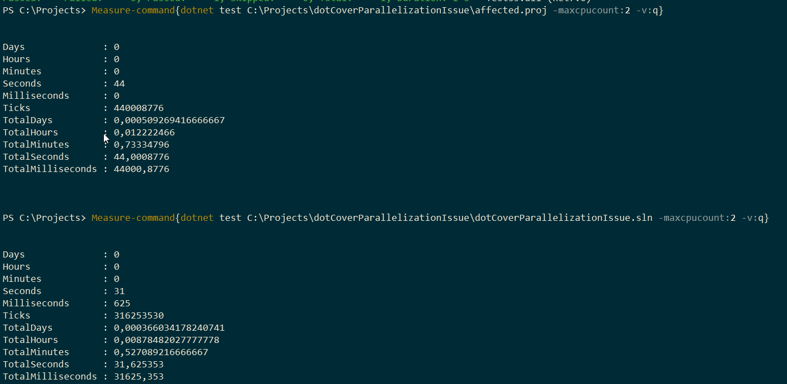

This repro is intended to show the unexpected difference in test parallelization logic when [Microsoft.Build.Traversal](https://github.com/microsoft/MSBuildSdks/tree/main/src/Traversal#microsoftbuildtraversal) is used.

The solution contains several test projects with 1 test in each project. One test sleeps for 30 sec, 1 test sleeps for 10 secs, other 4 tests sleep for 1 sec. When running tests with parallelization (level of parallelism is 2) we expect the run to take no more than 30 seconds. The reality meets our expectations when tests are run against solution file:

`dotnet test dotCoverParallelizationIssue.sln -maxcpucount:2`

When we run the tests against Microsoft.Build.Traversal project it takes more than 40 secs:

`dotnet test affected.proj -maxcpucount:2 -v:q`

